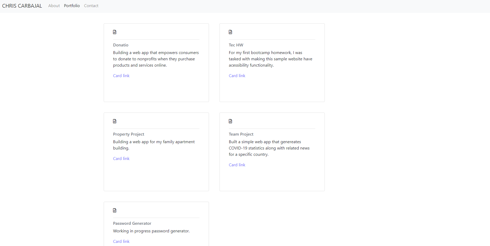

# tec-hw-2 (updated)

Created my first portfolio site with pages outlining 1. about me, 2. portfolio of projects, and 3. a contact form.

To complete the project, I leveraged Bootstrap, html, and css.

Link to portfolio page: https://venturecarbajal.github.io/tec-hw-02/

